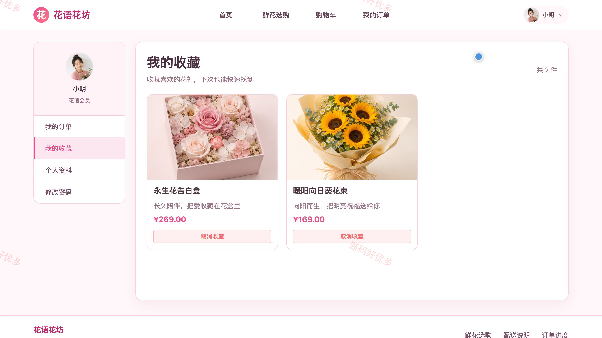
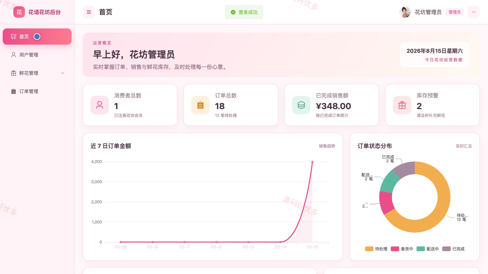
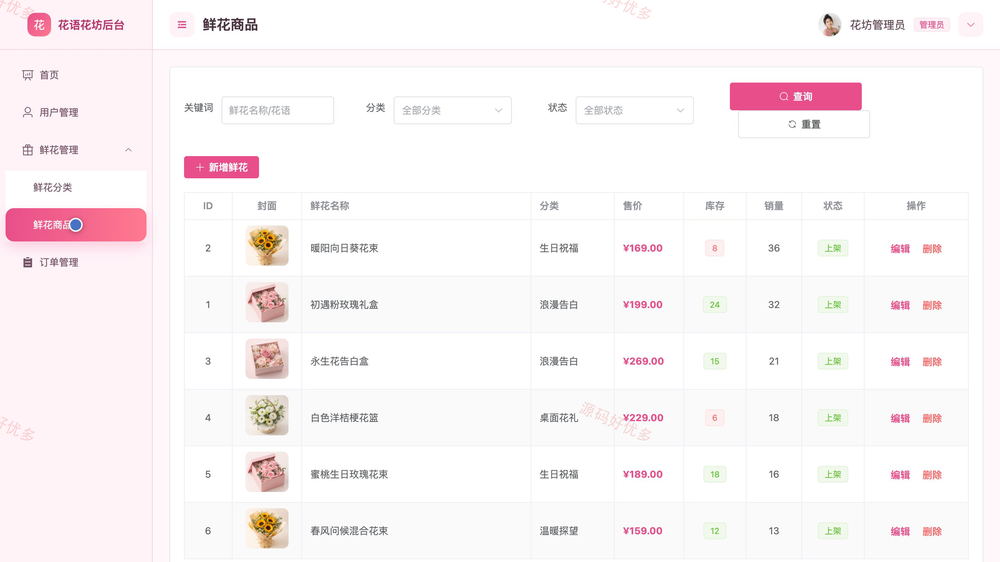
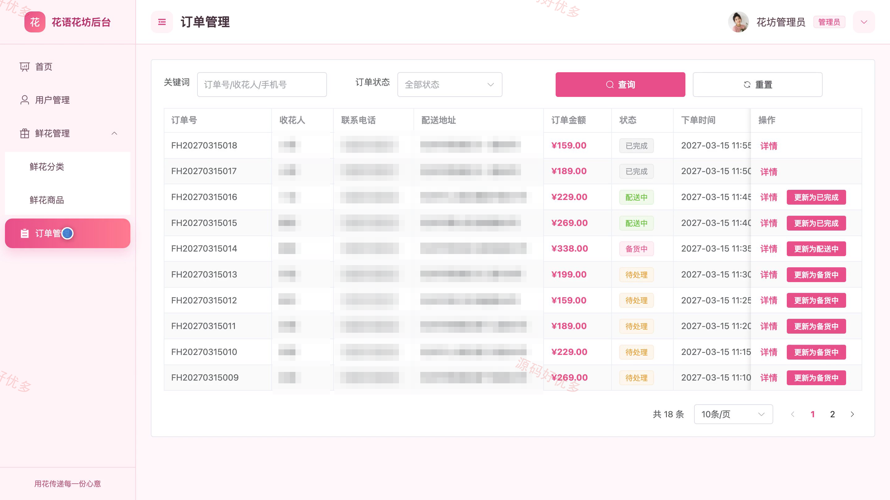

## 源码问题查看主页咨询

### 一、关键词
鲜花商城、网上花店、鲜花订购、花束选购、送花服务

### 二、作品包含
源码+数据库+全套环境和工具资源+本地部署教程

### 三、项目技术
前端技术： Html、Css、Js、Vue3.4、Element-Plus
后端技术：Java、SpringBoot3.2.0、MyBatis-Plus

### 四、运行环境（以下版本亲测，其他版本兼容性请自行测试）
开发工具：IDEA/eclipse + VSCODE

数据库：MySQL5.7+（共12张表）

数据库管理工具：Navicat10以上版本

环境配置软件： JDK17 + Maven

前端Nodejs：16+

浏览器：谷歌浏览器

### 五、项目介绍
项目编号：bs049A

系统面向鲜花零售与送花场景，提供鲜花分类浏览、商品详情、收藏、购物车、下单、配送进度和评价等消费者功能，并为管理员提供用户、分类、商品库存、订单处理与销售统计管理。

角色：消费者、管理员

消费者功能：账号登录与个人资料维护、鲜花分类与场景浏览、商品详情与评价查看、鲜花收藏管理、购物车管理、订单提交与状态跟踪、确认收货与商品评价。

管理员功能：消费者账号管理、鲜花分类管理、鲜花商品与库存管理、订单处理与配送状态更新、库存预警查看、销售与热销商品统计。

### 六、运行截图

